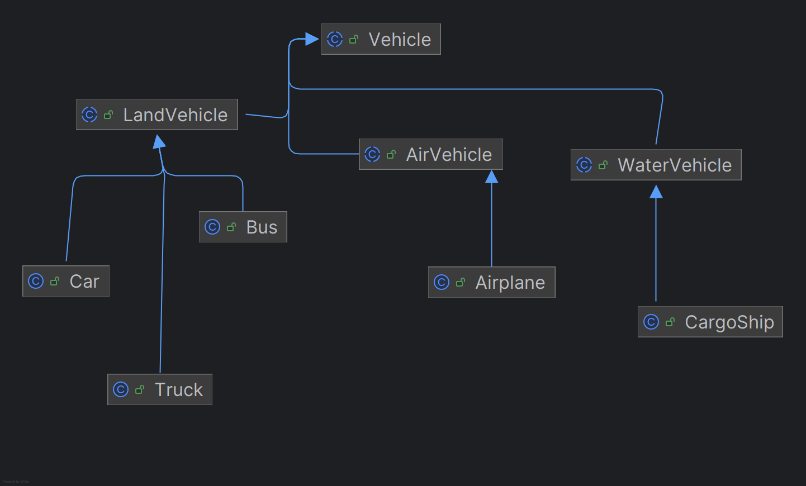
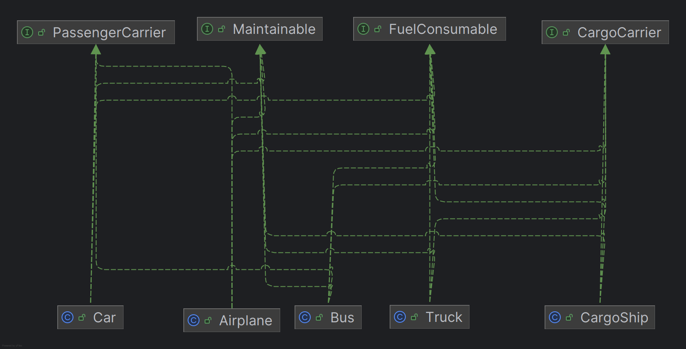

# Transportation Fleet Management System `Assignment`.

This repository contains java source file implemented by [Mohd Zaid]() `2024353` 
as part of assignment 1 of Advanced programming at **IIIT Delhi**.

## Overview 

This program is a Java-based simulation of a transportation fleet management
system for a logistics company. The system is designed to manage a diverse
fleet of vehicles operating across land, air, and water, including cars, trucks,
buses, airplanes, and cargo ships.

Project uses `ArrayList<T>` generic types to store all required information about vehicles.
along with `Set<T>` and `Map<K,V>` generic types to store unique and key-value pair information.

## Project `Structure`.

The project is organized into packages to ensure a clean separation of concerns

```text
src/
├── Abstracts/      # Base abstract classes (Vehicle, LandVehicle, etc.)
├── Core/           # Concrete vehicle implementations (Car, Truck, etc.)
├── Exceptions/     # Custom exception classes for error handling
├── Interfaces/     # Interfaces for modular behaviors
├── Utility/        # Helper classes (Writers, VehicleFactory, etc.)
└── Validators/     # Validation logic and other core classes
```

## Compile and Run `[USAGE]`

following code works on current working directory, out of source file.
```text
# ⚠️ do not cd into the src directory, stay in root of this project.
# ⚠️ you may need to make build folder using mkdir or touch "bin" folder.
```
```bash
javac -d bin -sourcepath src src/Main.java
java -cp bin Main
```

## `UML` Diagrams & Explanations


### Inheritance
following diagram explains relations between `ABCs` and their implementations.


> This system uses inheritance to create a family tree of vehicles,
starting with a general Vehicle blueprint and branching into specific
types like `LandVehicle`, `Car`, and `Truck`.

### Interfaces
following diagram explains relations between `Interfaces` and their implementations.


> Interfaces like CargoCarrier or FuelConsumable act like plug-ins.
They give specific abilities only to the vehicles that need them,
keeping the code clean and organized.

### Polymorphism

> We can issue a single command like move() to the entire fleet.
Polymorphism ensures each vehicle correctly performs its unique
action—whether it's driving, flying, or sailing.
other functions such as printing and all abstract Vehicle methods 
also show Polymorphism.

### Exception Handling

>nstead of crashing, the program uses custom exceptions to handle errors gracefully.
It gives specific warnings for impossible actions, like overloading a truck or running out of fuel.