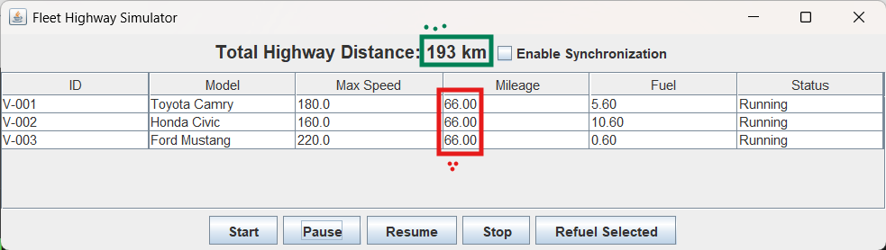
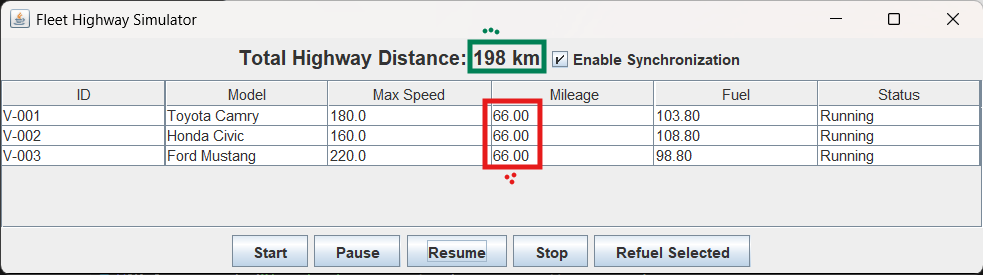

# Fleet Highway Simulator

## 1. Compilation and Execution

### Prerequisites
- Java Development Kit (JDK) 8 or higher.
- A terminal or command prompt.

### Steps
1.  Navigate to the project root directory:
    ```bash
    cd "c:\Users\mdzai\Assignments\AP Assignment-3"
    ```
2.  Compile the source code:
    ```bash
    javac -d out -sourcepath src src/Main.java
    ```
3.  Run the application:
    ```bash
    java -cp out Main
    ```

## 2. Design Overview

The system is designed using a multithreaded architecture where each vehicle operates as an independent thread.

-   **Core Classes**:
    -   `Vehicle` (Abstract): Base class defining common attributes (ID, model, speed).
    -   `LandVehicle` (Abstract): Extends `Vehicle` and implements `Runnable`. It contains the simulation loop and threading logic.
    -   `Car`: Concrete implementation of `LandVehicle` with fuel consumption and passenger capabilities.
    -   `Highway`: Represents the shared resource containing the total mileage counter.
-   **GUI**:
    -   `SimulatorGUI`: A Swing-based interface that displays vehicle status in a table and provides global controls.
-   **Main**:
    -   Initializes the highway and vehicles, then launches the GUI.

### GUI Layout
-   **Top Panel**: Displays the "Total Highway Distance" and a "Enable Synchronization" checkbox.
-   **Center Panel**: A table listing all vehicles with their real-time statistics (ID, Model, Speed, Mileage, Fuel, Status).
-   **Bottom Panel**: Control buttons (Start, Pause, Resume, Stop, Refuel Selected).

## 3. Simulation Control

The simulation is controlled entirely through the GUI, which interacts with the `LandVehicle` threads:

-   **Start**: Calls `start()` on all vehicle objects, launching a new thread for each if not already running.
-   **Pause**: Sets a `paused` flag in each vehicle. The threads enter a busy-wait loop (sleeping 100ms) until resumed.
-   **Resume**: Clears the `paused` flag, allowing the threads to continue processing.
-   **Stop**: Resets the highway mileage and vehicle mileage to 0.
-   **Refuel**: Replenishes the fuel of the selected vehicle and automatically resumes it if it was stopped due to lack of fuel.

## 4. Race Condition and Synchronization

### The Race Condition
The system demonstrates a race condition when multiple vehicle threads attempt to update the shared `Highway` mileage counter simultaneously without synchronization.

-   **Mechanism**: The `unsynchronizedIncrementMileage` method performs a read-modify-write operation (`mileage = mileage + by`). When two threads read the same value before either writes back, one update is lost.
-   **Observation**: As seen in the screenshot below, the "Total Highway Distance" is significantly lower than the sum of individual vehicle mileages.


*Figure 1: Unsynchronized execution showing inconsistent total distance.*

### The Fix
Synchronization is applied using the `synchronized` keyword in the `synchronizedIncrementMileage` method of the `Highway` class.

-   **Mechanism**: This ensures that only one thread can execute the increment operation at a time, preventing lost updates.
-   **Observation**: When "Enable Synchronization" is checked, the "Total Highway Distance" correctly matches the sum of all vehicle mileages.


*Figure 2: Synchronized execution showing correct total distance.*

## 5. GUI Thread Safety

The application adheres to Swing's single-threaded rule by ensuring that all UI updates and initializations occur on the **Event Dispatch Thread (EDT)**.

-   `SwingUtilities.invokeLater` is used in `Main.java` to launch the GUI.
-   The `javax.swing.Timer` used for refreshing the table (10 FPS) automatically executes its action listener on the EDT, ensuring that `tableModel` updates are thread-safe and do not conflict with the painting mechanism.